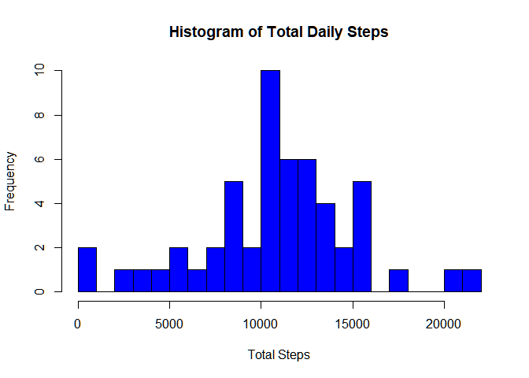
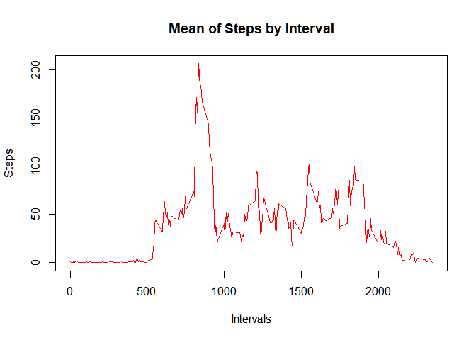
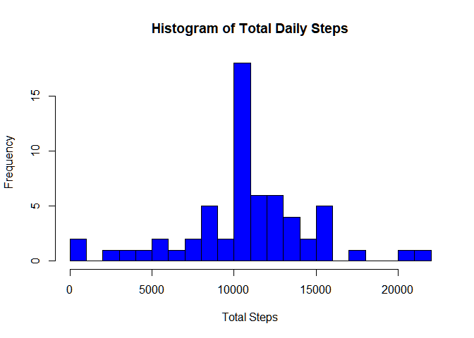
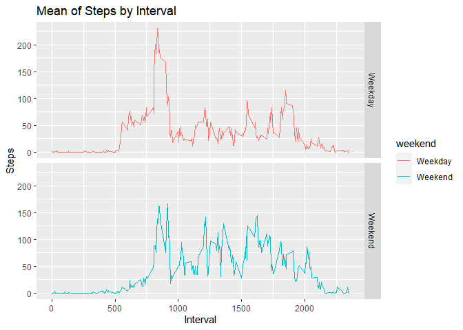

## Loading and preprocessing the data
Unzip the Load the data


```r
library(ggplot2)
library(dplyr)
```

```
## 
## Attaching package: 'dplyr'
```

```
## The following objects are masked from 'package:stats':
## 
##     filter, lag
```

```
## The following objects are masked from 'package:base':
## 
##     intersect, setdiff, setequal, union
```

```r
#unzip file if not done
if(!file.exists("activity.csv")){
     unzip("activity.zip")
}

#reading data into data frame
activity <- read.csv("activity.csv")
```

Summarize Data


```r
#data head
head(activity)
```

```
##   steps       date interval
## 1    NA 2012-10-01        0
## 2    NA 2012-10-01        5
## 3    NA 2012-10-01       10
## 4    NA 2012-10-01       15
## 5    NA 2012-10-01       20
## 6    NA 2012-10-01       25
```

```r
#data dimensions
dim(activity)
```

```
## [1] 17568     3
```

```r
#data summary
summary(activity)
```

```
##      steps                date          interval     
##  Min.   :  0.00   2012-10-01:  288   Min.   :   0.0  
##  1st Qu.:  0.00   2012-10-02:  288   1st Qu.: 588.8  
##  Median :  0.00   2012-10-03:  288   Median :1177.5  
##  Mean   : 37.38   2012-10-04:  288   Mean   :1177.5  
##  3rd Qu.: 12.00   2012-10-05:  288   3rd Qu.:1766.2  
##  Max.   :806.00   2012-10-06:  288   Max.   :2355.0  
##  NA's   :2304     (Other)   :15840
```

Tranformation and Modification of Data


```r
#change date field to date class
activity$date <- as.Date(as.character(activity$date))

#create NA vector
NAvec <- is.na(activity$steps)

#clean data
activityclean <- activity[!NAvec, ]
```


## What is mean total number of steps taken per day?
1. Calculate the total number of steps taken per day


```r
#calculating the sum of steps
stepsperday <- activityclean %>% select(date,steps) %>% group_by(date) %>% summarise(totalsteps = sum(steps))
```

2. Make a histogram of the total number of steps taken each day


```r
#plotting histogram
hist(stepsperday$totalsteps, xlab = "Total Steps", main="Histogram of Total Daily Steps", breaks = 20, col = "Blue")
```

<!-- -->

3. Calculate and report the mean and median of the total number of steps taken per day


```r
#calculating mean
mean(stepsperday$totalsteps, na.rm = TRUE)
```

```
## [1] 10766.19
```

```r
#calculating median
median(stepsperday$totalsteps, na.rm = TRUE)
```

```
## [1] 10765
```
## What is the average daily activity pattern?

1. Make a time series plot (i.e. type="l") of the 5-minute interval (x-axis) and the average number of steps taken, averaged across all days (y-axis)


```r
#calculating the mean steps
stepsbyinterval <- activityclean %>% select(interval, steps) %>% group_by(interval) %>% summarise(averagesteps = mean(steps))

#line plot
plot(stepsbyinterval$interval, stepsbyinterval$averagesteps, type = "l", main = "Mean of Steps by Interval", xlab = "Intervals", ylab = "Steps", col = "Red")
```

<!-- -->

2. Which 5-minute interval, on average across all the days in the dataset, contains the maximum number of steps?


```r
stepsbyinterval[which(stepsbyinterval$averagesteps == max(stepsbyinterval$averagesteps)),]
```

```
## # A tibble: 1 x 2
##   interval averagesteps
##      <int>        <dbl>
## 1      835         206.
```


## Imputing missing values

1. Calculate and report the total number of missing values in the dataset (i.e. the total number of rows with NAs)


```r
missingvalues <- sum(NAvec)
missingvalues
```

```
## [1] 2304
```

2. Devise a strategy for filling in all of the missing values in the dataset. 

Stratergy: using mean steps for the interval

3. Create a new dataset that is equal to the original dataset but with the missing data filled in.


```r
#new dataset with statergy
replacewithmean <- function(x) replace(x, is.na(x), mean(x, na.rm = TRUE))
activity2 <- activity %>% group_by(interval) %>% mutate(steps= replacewithmean(steps))

#original NA count
sum(NAvec)
```

```
## [1] 2304
```

```r
#count of NA after applying stratergy
sum(is.na(activity2$steps))
```

```
## [1] 0
```

4. 
a. Make a histogram of the total number of steps taken each day and Calculate and report the mean and median total number of steps taken per day. 


```r
#calculating sum of steps
stepsperdaywithna <- activity2 %>% select(date,steps) %>% group_by(date) %>% summarise(totalsteps = sum(steps))
```

```
## Adding missing grouping variables: `interval`
```

```r
#plotting histogram
hist(stepsperdaywithna$totalsteps, xlab = "Total Steps", main="Histogram of Total Daily Steps", breaks = 20, col = "Blue")
```

<!-- -->

b. Do these values differ from the estimates from the first part of the assignment? 

```r
#calculating mean
mean(stepsperdaywithna$totalsteps)
```

```
## [1] 10766.19
```

```r
#calculating median
median(stepsperdaywithna$totalsteps)
```

```
## [1] 10766.19
```
The Mean is same but the median has risen by 1.19 steps.

Original Mean and Median

```
## [1] 10766.19
```

```
## [1] 10765
```

New Mean and Median

```
## [1] 10766.19
```

```
## [1] 10766.19
```
c. What is the impact of imputing missing data on the estimates of the total daily number of steps?
The effect of using mean data per interval as a data impute method for missing values seems to push overall data towards the mean.

## Are there differences in activity patterns between weekdays and weekends?


```r
#create a weekday column
activity2$weekday <- weekdays(activity2$date)

#specify weekday or weekend
activity2$weekend <- ifelse(activity2$weekday == "Saturday" | activity2$weekday == "Sunday", "Weekend", "Weekday") 

head(activity2)
```

```
## # A tibble: 6 x 5
## # Groups:   interval [6]
##    steps date       interval weekday weekend
##    <dbl> <date>        <int> <chr>   <chr>  
## 1 1.72   2012-10-01        0 Monday  Weekday
## 2 0.340  2012-10-01        5 Monday  Weekday
## 3 0.132  2012-10-01       10 Monday  Weekday
## 4 0.151  2012-10-01       15 Monday  Weekday
## 5 0.0755 2012-10-01       20 Monday  Weekday
## 6 2.09   2012-10-01       25 Monday  Weekday
```

```r
stepsbyintervalwithna <- activity2 %>% select(interval, steps, weekend) %>% group_by(interval, weekend) %>% summarise(averagesteps = mean(steps))

ggplot(stepsbyintervalwithna, aes(x = interval, y=averagesteps, color=weekend)) +
  geom_line() +
  facet_grid(weekend ~ .) +
  labs(title = "Mean of Steps by Interval", x = "Interval", y = "Steps")
```

<!-- -->


Large incidents of steps during weekend and variation in the beginning of the day during weekdays, which might be due to workplace activities.
